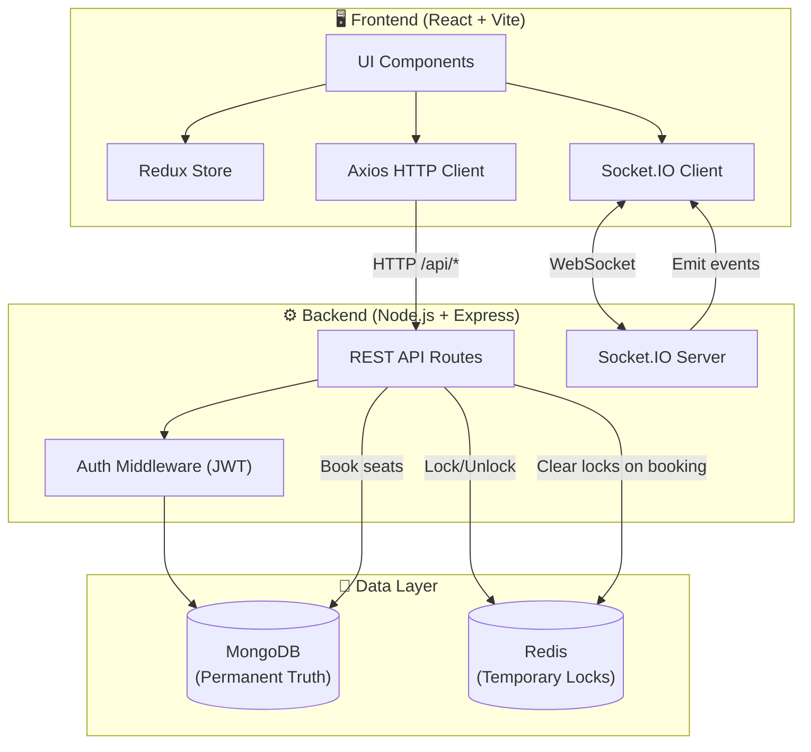
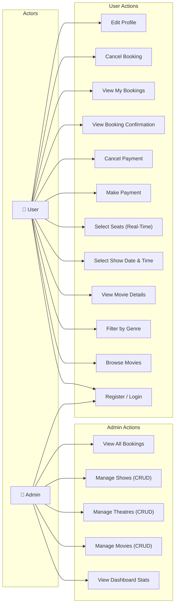
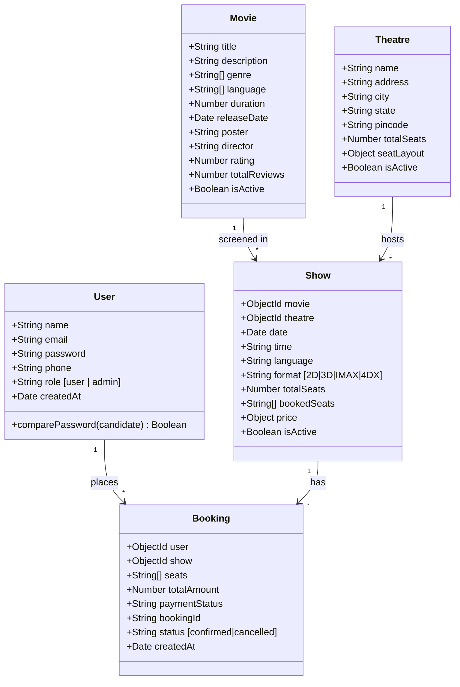
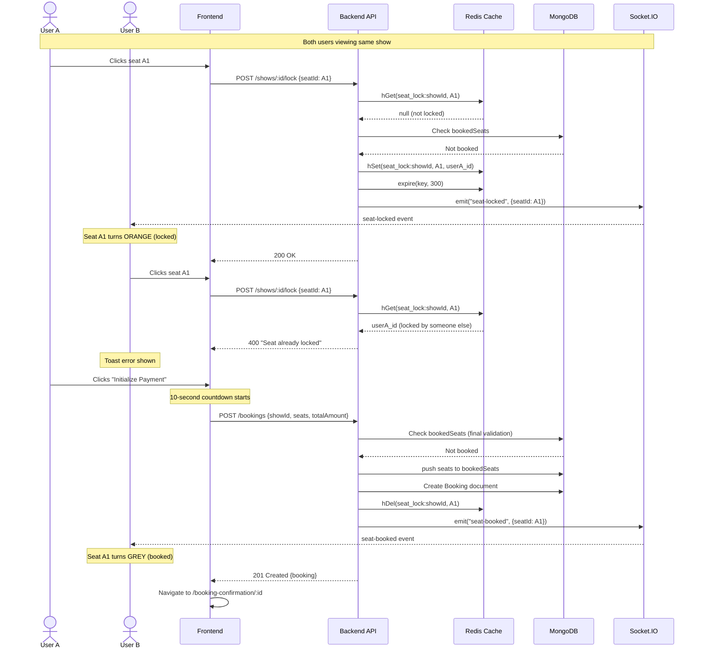
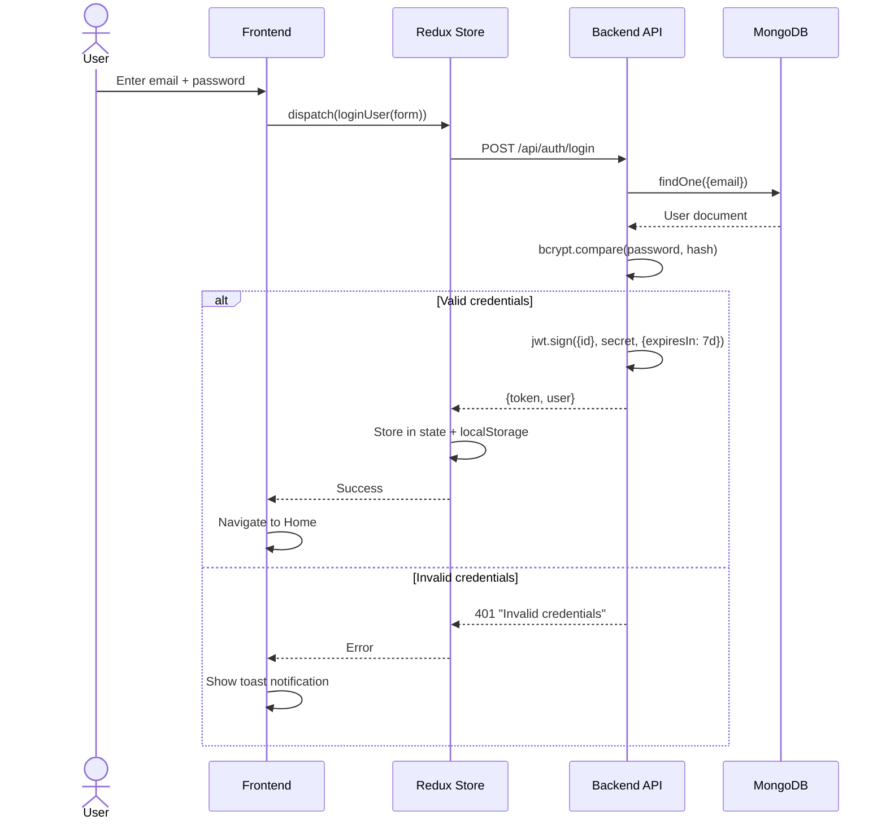
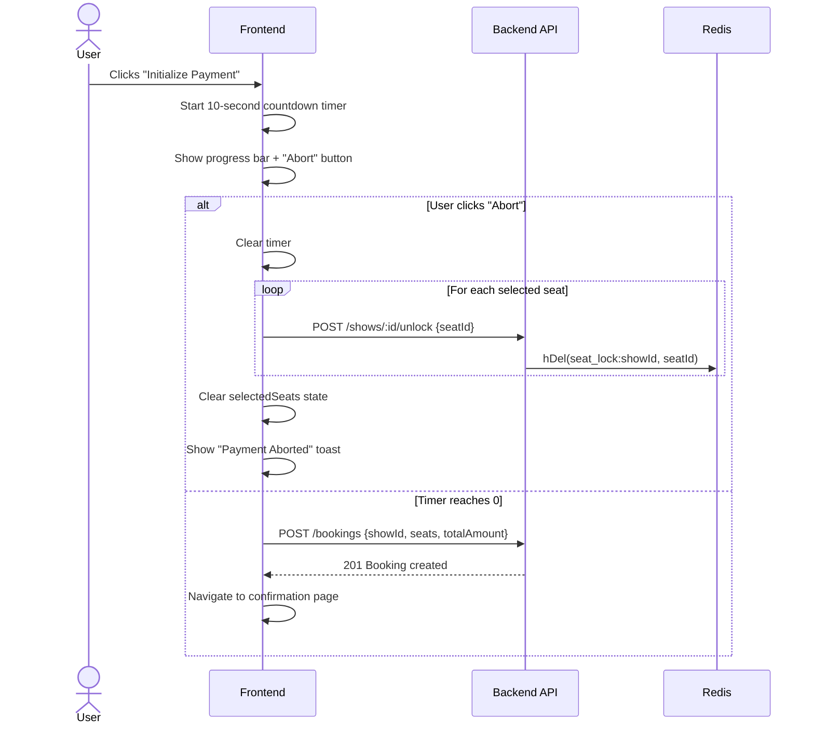
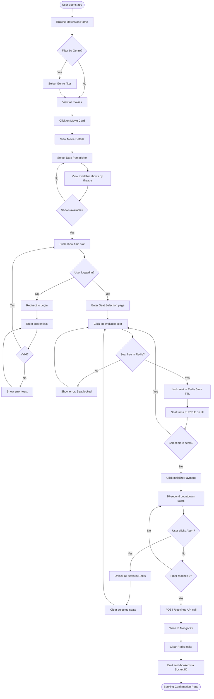
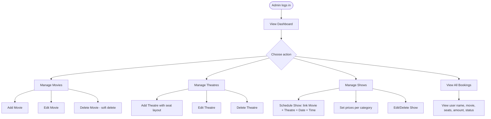

# 🎬 CINEVERSE — Real-Time Movie Booking Platform

> A full-stack, production-grade movie ticket booking system built with the **MERN stack**, enhanced with **Redis** for distributed seat locking and **Socket.IO** for real-time synchronization — preventing double bookings across concurrent users.

---

## 📑 Table of Contents

- [Introduction](#-introduction)
- [Tech Stack](#-tech-stack)
- [System Architecture](#-system-architecture)
- [Use Case Diagram](#-use-case-diagram)
- [Class Diagram (Data Models)](#-class-diagram-data-models)
- [Sequence Diagrams](#-sequence-diagrams)
- [Activity Diagrams](#-activity-diagrams)
- [Project Structure](#-project-structure)
- [Features Deep Dive](#-features-deep-dive)
- [API Reference](#-api-reference)
- [Real-Time Seat Locking (Redis + Socket.IO)](#-real-time-seat-locking-redis--socketio)
- [Frontend Architecture](#-frontend-architecture)
- [Authentication & Authorization](#-authentication--authorization)
- [Setup & Installation](#-setup--installation)
- [Environment Variables](#-environment-variables)
- [Database Seeding](#-database-seeding)
- [Default Credentials](#-default-credentials)

---

## 🧠 Introduction

**Cineverse** is not a simple CRUD app — it solves the real-world **distributed concurrency problem** of ticket booking. When two users try to book the same seat at the same time, the system must guarantee that only one succeeds. This is achieved through a **dual-layer architecture**:

| Layer | Technology | Purpose |
|-------|-----------|---------|
| **Permanent Truth** | MongoDB | Stores confirmed bookings forever |
| **Temporary Locks** | Redis | Holds 5-minute seat reservations (TTL) |
| **Live Sync** | Socket.IO | Broadcasts lock/unlock/book events instantly |

**Key Principle:** MongoDB is the **final source of truth**. Redis is the **temporary state manager**. Socket.IO is the **real-time messenger**.

---

## 🛠 Tech Stack

| Component | Technology | Version |
|-----------|-----------|---------|
| Frontend | React + Vite | 18.x |
| State Management | Redux Toolkit | 2.x |
| Styling | TailwindCSS | 3.x |
| Backend | Node.js + Express | 4.18 |
| Database | MongoDB + Mongoose | 8.x |
| Cache / Locking | Redis | 5.x |
| Real-Time | Socket.IO | 4.8 |
| Auth | JWT + bcryptjs | — |
| HTTP Client | Axios | — |

---

## 🏗 System Architecture



### How Data Flows

1. **User browses movies** → Frontend calls `GET /api/movies` → Express queries MongoDB → Returns JSON
2. **User selects a seat** → Frontend calls `POST /api/shows/:id/lock` → Express writes to Redis (5min TTL) → Socket.IO broadcasts `seat-locked` to all users viewing that show
3. **User pays** → Frontend calls `POST /api/bookings` → Express verifies Redis lock → Writes to MongoDB → Clears Redis lock → Socket.IO broadcasts `seat-booked`
4. **Lock expires** → Redis auto-deletes after 5 minutes → Seat becomes available again

---

## 📊 Use Case Diagram



---

## 📐 Class Diagram (Data Models)



### Seat Layout Structure (Theatre)

```json
{
  "rows": 8,
  "cols": 10,
  "categories": [
    { "name": "Recliner", "rows": ["A", "B"], "price": 500 },
    { "name": "Gold",     "rows": ["C", "D", "E"], "price": 300 },
    { "name": "Silver",   "rows": ["F", "G", "H"], "price": 180 }
  ]
}
```

---

## 🔄 Sequence Diagrams

### 1. Seat Selection & Booking Flow



### 2. Authentication Flow



### 3. Payment Timer & Cancellation Flow



---

## 📋 Activity Diagrams

### Complete Booking Workflow



### Admin Workflow



---

## 📁 Project Structure

```
movie-booking/
├── client/                          # Frontend (React + Vite)
│   ├── src/
│   │   ├── components/
│   │   │   ├── Navbar.jsx           # Responsive nav with admin link
│   │   │   ├── Footer.jsx           # Site footer
│   │   │   ├── MovieCard.jsx        # Movie poster card component
│   │   │   ├── SeatLayout.jsx       # Interactive seat grid (8x10)
│   │   │   └── Spinner.jsx          # Loading spinner
│   │   ├── pages/
│   │   │   ├── Home.jsx             # Hero + movie grid with genre filter
│   │   │   ├── MovieDetails.jsx     # Movie info + date picker + shows
│   │   │   ├── BookingPage.jsx      # Seat selection + checkout + timer
│   │   │   ├── BookingConfirmation.jsx  # Ticket confirmation card
│   │   │   ├── MyBookings.jsx       # User's booking history
│   │   │   ├── Profile.jsx          # User profile editor
│   │   │   ├── Login.jsx            # Login form
│   │   │   ├── Register.jsx         # Registration form
│   │   │   ├── NotFound.jsx         # 404 page
│   │   │   └── Admin/
│   │   │       ├── AdminDashboard.jsx   # Stats + quick actions
│   │   │       ├── AdminMovies.jsx      # CRUD movies
│   │   │       ├── AdminTheatres.jsx    # CRUD theatres
│   │   │       ├── AdminShows.jsx       # Schedule shows
│   │   │       └── AdminBookings.jsx    # View all bookings
│   │   ├── redux/
│   │   │   ├── store.js             # Redux store config
│   │   │   └── slices/
│   │   │       └── authSlice.js     # Auth state (login/register/logout)
│   │   ├── utils/
│   │   │   ├── api.js               # Axios instance with JWT interceptor
│   │   │   └── socket.js            # Socket.IO client instance
│   │   ├── App.jsx                  # Routes + ProtectedRoute + AdminRoute
│   │   ├── main.jsx                 # Entry point (Redux Provider)
│   │   └── index.css                # Global styles + Tailwind
│   ├── vite.config.js
│   └── package.json
│
├── server/                          # Backend (Node.js + Express)
│   ├── models/
│   │   ├── User.js                  # User schema (bcrypt pre-save hook)
│   │   ├── Movie.js                 # Movie schema
│   │   ├── Theatre.js               # Theatre schema (seat layout)
│   │   ├── Show.js                  # Show schema (links movie + theatre)
│   │   └── Booking.js               # Booking schema (auto bookingId)
│   ├── routes/
│   │   ├── auth.js                  # Register, Login, Profile update
│   │   ├── movies.js                # CRUD movies (admin-protected)
│   │   ├── theatres.js              # CRUD theatres (admin-protected)
│   │   ├── shows.js                 # CRUD shows + Lock/Unlock endpoints
│   │   └── bookings.js              # Create/Cancel bookings + Redis cleanup
│   ├── middleware/
│   │   └── auth.js                  # JWT verify (protect) + adminOnly
│   ├── utils/
│   │   └── redisClient.js           # Redis connection manager
│   ├── server.js                    # Express + Socket.IO + MongoDB + Redis init
│   ├── package.json
│   └── .env
│
├── seed.js                          # Database seeder (movies, theatres, shows, users)
├── setup_guide.md
└── README.md
```

---

## ✨ Features Deep Dive

### 1. Movie Browsing & Filtering
- Home page displays all active movies in a responsive grid
- Genre filter bar (Action, Comedy, Drama, Horror, Thriller, Sci-Fi, etc.)
- Each `MovieCard` shows poster, title, duration, genre tags, language badges, and rating

### 2. Movie Details & Show Selection
- Cinematic hero banner with blurred poster background
- 7-day date picker to browse upcoming shows
- Shows grouped by theatre with available seat count
- Format badges (2D, 3D, IMAX) and "Sold Out" indicators

### 3. Real-Time Seat Selection
- 8×10 interactive seat grid divided into 3 categories (Recliner, Gold, Silver)
- **4 visual states:** Available (dark), Selected (purple glow), Locked (orange glow), Booked (grey)
- Clicking a seat calls the `/lock` API → Redis stores the lock → Socket.IO notifies all viewers
- Other users see your selected seats turn orange in real-time

### 4. Payment Timer (10-second countdown)
- After clicking "Initialize Payment", a 10-second countdown starts with a progress bar
- User can click "Abort" to cancel — which unlocks all selected seats in Redis
- If timer reaches 0, the booking is finalized in MongoDB

### 5. Booking Confirmation
- Digital ticket card with movie poster, theatre, date, time, seats, amount
- Auto-generated booking ID (format: `BMS{timestamp}{random}`)
- Links to "My Bookings" and "Home"

### 6. Booking Management
- Users can view all their bookings (confirmed + cancelled)
- Cancel button releases seats back (removes from `bookedSeats` array in MongoDB)
- Cancellation sets `paymentStatus: 'refunded'`

### 7. User Profile
- View/edit name and phone number
- Displays total booking count and account type
- Admin badge for admin users

### 8. Admin Panel
- **Dashboard:** Live stats (movies, theatres, shows, bookings, revenue) + recent bookings feed
- **Manage Movies:** Add/Edit/Delete (soft delete via `isActive` flag)
- **Manage Theatres:** Configure seat layouts with row categories and pricing
- **Manage Shows:** Link movie + theatre + date + time + format + language + pricing
- **View Bookings:** Master list of all bookings with user info

---

## 🌐 API Reference

### Authentication (`/api/auth`)

| Method | Endpoint | Auth | Description |
|--------|----------|------|-------------|
| POST | `/register` | — | Create new user |
| POST | `/login` | — | Login, returns JWT |
| GET | `/me` | JWT | Get current user profile |
| PUT | `/update-profile` | JWT | Update name & phone |

### Movies (`/api/movies`)

| Method | Endpoint | Auth | Description |
|--------|----------|------|-------------|
| GET | `/` | — | List movies (filter: search, genre, language) |
| GET | `/:id` | — | Get single movie |
| POST | `/` | Admin | Create movie |
| PUT | `/:id` | Admin | Update movie |
| DELETE | `/:id` | Admin | Soft delete movie |

### Theatres (`/api/theatres`)

| Method | Endpoint | Auth | Description |
|--------|----------|------|-------------|
| GET | `/` | — | List theatres (filter: city) |
| GET | `/:id` | — | Get single theatre |
| POST | `/` | Admin | Create theatre |
| PUT | `/:id` | Admin | Update theatre |
| DELETE | `/:id` | Admin | Soft delete theatre |

### Shows (`/api/shows`)

| Method | Endpoint | Auth | Description |
|--------|----------|------|-------------|
| GET | `/` | — | List shows (filter: movie, date, theatreId) |
| GET | `/:id` | — | Get show + lockedSeats from Redis |
| POST | `/:id/lock` | JWT | Lock a seat in Redis (5min TTL) |
| POST | `/:id/unlock` | JWT | Unlock your own seat in Redis |
| POST | `/` | Admin | Create show |
| PUT | `/:id` | Admin | Update show |
| DELETE | `/:id` | Admin | Soft delete show |

### Bookings (`/api/bookings`)

| Method | Endpoint | Auth | Description |
|--------|----------|------|-------------|
| POST | `/` | JWT | Create booking (validates Redis locks, writes MongoDB) |
| GET | `/my` | JWT | Get current user's bookings |
| GET | `/:id` | JWT | Get single booking (owner or admin) |
| PUT | `/:id/cancel` | JWT | Cancel booking & release seats |
| GET | `/` | Admin | Get all bookings |

---

## 🔐 Real-Time Seat Locking (Redis + Socket.IO)

### Redis Data Design

```
Key:     seat_lock:{showId}
Type:    Hash
Fields:  seatId → userId
TTL:     300 seconds (5 minutes)

Example:
  seat_lock:665abc123def → { "A1": "user123", "A2": "user123", "B5": "user456" }
```

### Socket.IO Events

| Event | Direction | Payload | When |
|-------|-----------|---------|------|
| `join-show` | Client → Server | `showId` | User opens booking page |
| `seat-locked` | Server → Room | `{ seatId, userId }` | Seat locked in Redis |
| `seat-unlocked` | Server → Room | `{ seatId }` | Seat unlocked from Redis |
| `seat-booked` | Server → Room | `{ seatId }` | Seat permanently booked in MongoDB |

### Why This Architecture Prevents Double Bookings

1. **Redis acts as a distributed lock manager** — only one user can hold a lock per seat
2. **TTL auto-cleanup** — if a user abandons the page, locks expire in 5 minutes
3. **Socket.IO provides instant feedback** — other users see locks in real-time
4. **MongoDB final validation** — even if Redis fails, the booking endpoint re-checks `bookedSeats`

---

## 🖥 Frontend Architecture

### State Management

```
Redux Store
└── auth
    ├── user (from localStorage)
    ├── token (from localStorage)
    ├── loading
    └── error
```

All other state (movies, shows, bookings) is managed locally in components via `useState` + API calls.

### Route Protection

| Wrapper | Logic | Used For |
|---------|-------|----------|
| `ProtectedRoute` | Redirects to `/login` if no user | Booking, Profile, My Bookings |
| `AdminRoute` | Redirects to `/login` if no user, `/` if not admin | All `/admin/*` routes |

### Axios Interceptors

- **Request:** Automatically attaches `Authorization: Bearer <token>` header
- **Response:** On 401 error, clears localStorage and redirects to `/login`

---

## 🔑 Authentication & Authorization

### Password Security
- Passwords are hashed using **bcryptjs** with **12 salt rounds** via a Mongoose `pre('save')` hook
- Raw passwords are never stored in the database

### JWT Tokens
- Signed with `JWT_SECRET` environment variable
- Default expiry: **7 days**
- Stored in `localStorage` on the client
- Verified on every protected API call via the `protect` middleware

### Role-Based Access
- `user` role: Can browse, book, cancel, and manage their own profile
- `admin` role: Full CRUD on movies, theatres, shows + view all bookings + dashboard

---

## 🚀 Setup & Installation

### Prerequisites

- **Node.js** v18+
- **MongoDB** running on `localhost:27017`
- **Redis** running on `localhost:6379`

### Step 1: Clone & Install

```bash
git clone <repo-url>
cd movie-booking

# Install backend dependencies
cd server && npm install

# Install frontend dependencies
cd ../client && npm install
```

### Step 2: Configure Environment

```bash
# In server/.env
PORT=5001
MONGO_URI=mongodb://localhost:27017/movie-booking
JWT_SECRET=your_secret_key_here
JWT_EXPIRE=7d
CLIENT_URL=http://localhost:5173
REDIS_URL=redis://localhost:6379
```

### Step 3: Seed Database

```bash
cd movie-booking
node seed.js
```

### Step 4: Start Services

```bash
# Terminal 1 — Start Redis
brew services start redis

# Terminal 2 — Start Backend
cd server && npm run dev

# Terminal 3 — Start Frontend
cd client && npm run dev
```

Visit **http://localhost:5173**

---

## 🔐 Default Credentials

| Role | Email | Password |
|------|-------|----------|
| Admin | `admin@bookmyshow.com` | `admin123` |
| User | `user@bookmyshow.com` | `user123` |

---

## 📄 License

This project is for educational and portfolio purposes.
